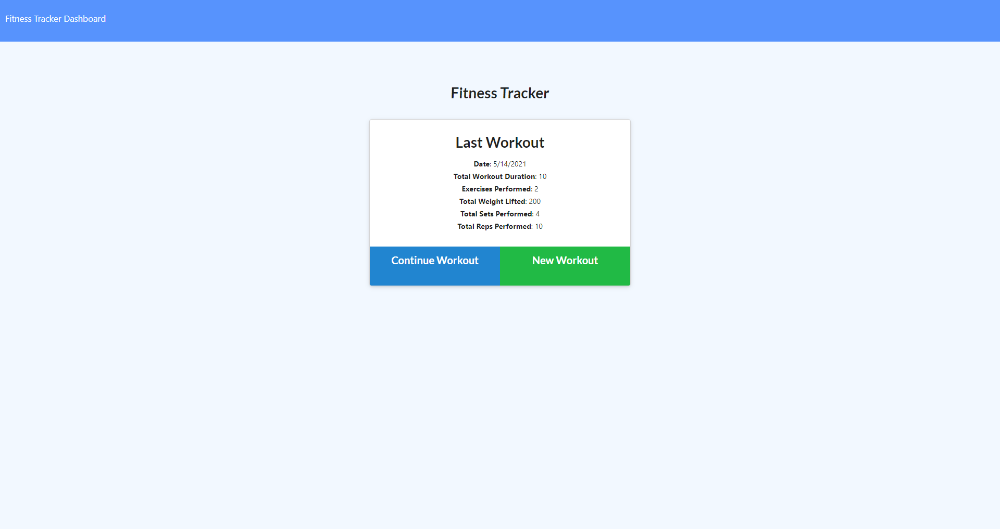

# Fitness-tracker

## Description
This is a fitness tracker app. No one has a perfect memory, and sometimes, it's difficult to remember what you did eariler in the week, or even eariler in the day. Did you do bench presses today? Or last week? Fitness trackers can help with these lapses in memory, and they can tell you just how much you've done in the day or week! You can use this information to decide what kinds of exercise you should do next!

I learned a lot from this project, such as how to use $addFields and $push.

## Screenshot

## Link
<a href="https://aurora-fitness-tracker.herokuapp.com/">Heroku Link</a>